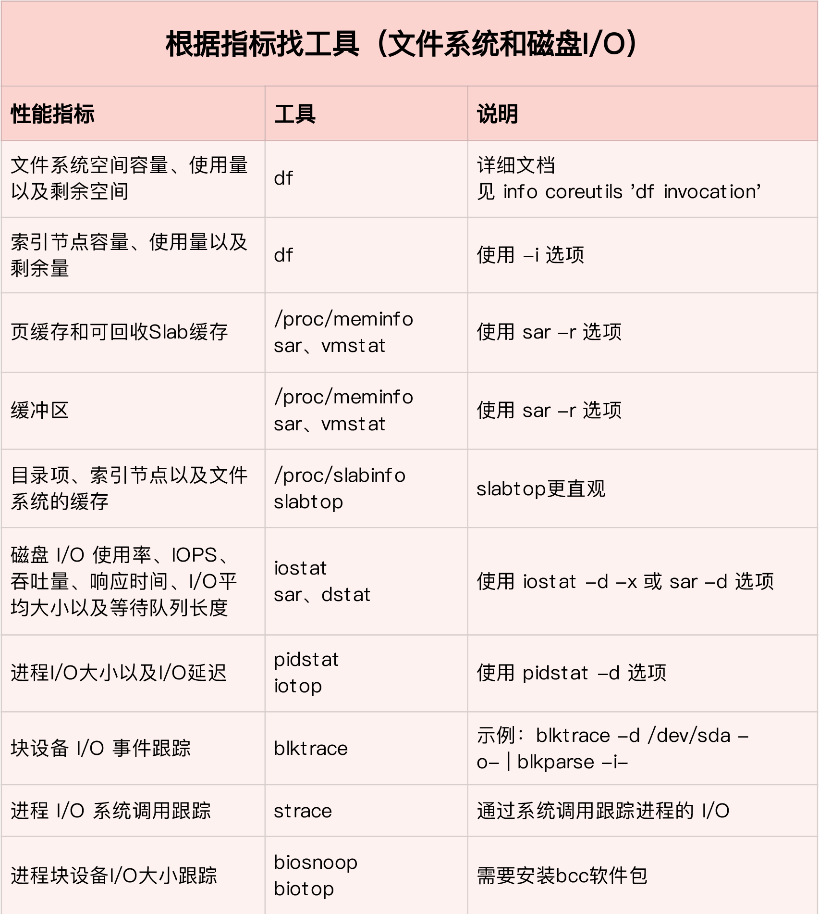

cpu负载情况

```shell
uptime
```

stress 是一个 Linux 系统压力测试工具，这里我们用作异常进程模拟平均负载升高的场景

```shell
stress --cpu 1 --timeout 30
stress -i 4 --timeout 30
stress -c 1 --timeout 30
```

pidstat 是一个常用的进程性能分析工具，用来实时查看进程的 CPU、内存、I/O 以及上下文切换等性能指标。

```shell
pidstat -u 5 1
pidstat -w 5
pidstat -w -u 1
pidstat -wt 1
```

mpstat 是一个常用的多核 CPU 性能分析工具，用来实时查看每个 CPU 的性能指标，以及所有 CPU 的平均指标。

```shell
mpstat -P ALL 5 1
```

vmstat 是一个常用的系统性能分析工具，主要用来分析系统的内存使用情况，也常用来分析 CPU 上下文切换和中断的次数。

```shell
vmstat 5
vmstat 1 1
```

sysbench 是一个多线程的基准测试工具，一般用来评估不同系统参数下的数据库负载情况。当然，在这次案例中，我们只把它当成一个异常进程来看，作用是模拟上下文切换过多的问题。

```shell
sysbench --threads=10 --max-time=300 threads run
#测试8K顺序分配：
sysbench --threads=4 --events=10000 --test=memory --memory-block-size=8K --memory-total-size=3G --memory-access-mode=seq run
```

dstat 是一个新的性能工具，它吸收了 vmstat、iostat、ifstat 等几种工具的优点，可以同时观察系统的 CPU、磁盘 I/O、网络以及内存使用情况。

```shell
dstat 1 10
```

dd 命令，通过读取随机设备，生成一个 500MB 大小的文件：

```
dd if=/dev/urandom of=/tmp/file bs=1M count=500
```

iostat 是最常用的磁盘 I/O 性能观测工具，它提供了每个磁盘的使用率、IOPS、吞吐量等各种常见的性能指标，当然，这些指标实际上来自 /proc/diskstats。

```shell
iostat -d -x 1 
```

